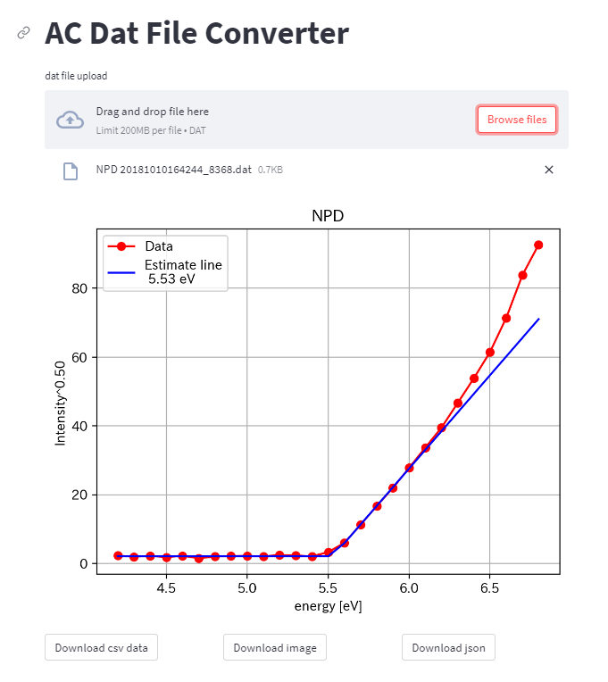
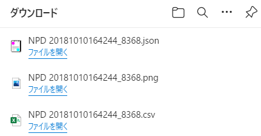

# ACdataConverter

### OverView

このプログラムは、理研計器の大気中光電子収量分光装置(ACシリーズ)から出力される計測データファイル（拡張子.dat）から、計測メタデータ、計測補正データをEXCELおよびJSON形式で変換出力するものです。Pythonにより作成されています。メタデータ詳細については、このファイルの後半に記載されています。

このプログラムの詳細は、こちらを参考にしてください。

S. Yagyu: Journal of Surface Analysis. 29 [2] (2022) 97-110.

Stremlit Cloudを利用してWebアプリを作成しました。こちらをご利用の方は、下記のURLでdatファイルをアップロードしてみてください。またローカルで利用したい方はアプリの説明の後のインストールからお試しください。

### AC Dat File Converter (Streamlit アプリ）

ACシリーズから得られた計測ファイル（拡張子.dat）をアップロードすると、グラフ描画、メタデータの抽出を行うWebサービスです。

なお、測定後手動でデータの解析を行っている場合は、その閾値と推定のラインも表示されます。

下にあるダウンロードボタンで各種データを取得することができます。




ダウンロードファイルは以下の通りです。




- JSONファイル：JSON形式でdatファイルに含まれるメタデータ及び、datデータから計算された結果が含まれています。(メタデータの詳細については後半に記述があります。)
- PNGファイル：ブラウザーで表示されたグラフの画像ファイルです。
- CSVファイル：uvEnergy、pyield、npyield、nayield、guidelineのデータが含まれています。各列の説明は以下の通りです。


| Key      |                                             | 説明                                                         |
| -------- | ------------------------------------------- | ------------------------------------------------------------ |
| uvEnergy | UV Energy                                   | 照射光エネルギー                                             |
| pyield   | Photoelectron Yield                         | 光電子収率                                                   |
| npyield  | nth-power Photoelectron Yield               | n乗光電子収率                                                |
| nayield  | nth-power Photoelectron Yield　for analysis | n乗光電子収率(手動解析に用いるもの、差分補正あり・なしに依存。補正なしではnpyieldと同じ値) |
| guidline | Fitting line using ReLU function            | Guidline（手動閾値解析後の値による結果）                     |


### Installation and Required Modules

プログラムは、こちらのサイトからCloneまたはダウンロードして利用ください。


Pythonのバージョンは3.7以上、必要モジュールは、pandas, scipy, numpy, matplotlib, openpyxl, jupyterです。

### Folder Structure

```shell
ACdataConverter
|
|--acdatconv 				  	# main module
|  |-__init__.py				# init file
|  |-datconv.py  				# main program
|  |-datlib.py 					# Other library
|  |-validation_excel_read.py	# For read excel
|
|--validationData				# validation data
|  |-AC2S_off.dat
|  |-AC2S_off.xlsx
|  |-AC2S_on.dat
|  |-AC2S_on.xlsx
|  |-AC3_off.dat
|  |-AC3_off.xlsx
|
|--html_output								# output files and examples
|  |-ex_converter_one_file.html				# example of AC3_off dat reading
|  |-ex_converter_list.ipynb				# example of read data from validation folder 
|  |-ex_converter_one_file_validation.html	# Validation Results
|  |-validationData.xlsx					# output file of ex_converter_list
|  |-validationData_wo.xlsx					# output file of ex_converter_list
|
|--README								# README file
|--converter_one_file.ipynb				# template for one file
|--converter_list.ipynb					# template for folder
|--converter_one_file_colab.ipynb		# template for one file with google colaboratory
|--converter_list_colab.ipynb			# template for folder with google colaboratory
|
|
|--dat_main.py			  		# Streamlit main program
|--packages.txt			  		# for Streamlit cloud setting
|--requirement.txt			 	# for Streamlit cloud setting

```


### Examples
（1）Local環境（自身のPC）での使用（python(3.7以上)の他に、pandas、scipy、numpy、matplotlib、openpyxl、jupyterのインストールが必要）

- converter_one_file.ipynb:  一つのdatファイルからメタデータ出力、解析値およびグラフ表示
- converter_list.ipynb: フォルダー内にあるすべてのdatデータを読み込み、メタデータ出力、グラフ表示、帳票作成

（2）google Colaboratoryでの利用

- converter_one_file_for_colab.ipynb:  一つのdatファイルからメタデータ出力、解析値およびグラフ表示

- converter_list_for_colab.ipynb: フォルダー内にあるすべてのdatデータを読み込み、メタデータ出力、グラフ表示、帳票作成


### 理研計器ACシリーズの Data Formatについて

理研計器では、データ駆動型研究に対応するために、大気中光電子収量分光装置(ACシリーズ)の出力ファイルのフォーマットを統一し、その詳細について公表した[1]。出力ファイルの拡張子は、.datとしている。.datファイルは、計測パラメータ及び測定値がCSV形式で記載されており、Text editorなどで可読可能である。今後販売されるAC-2S以降の装置では、.dat形式のファイルが標準で出力される。それ以前の測定装置については、理研計器により提供される変換ソフトにて、.dat形式に変換することができる。


[1] 理研計器M285-22010「AC-2S データ変換ソフト取扱説明書」

#### ACシリーズの機種とデータ形式および変換後の形式

- AC-1：廃機種のため対象外

- AC-2、AC-3：（MDB型）変換ソフトで.datフォーマット（新形式0） へ変換 
  
- AC-5：.datフォーマット（旧形式） 変換ソフトで.datフォーマット（新形式）へ変換

- AC-2S: .datフォーマット（新形式）

  ※注意：AC-2,AC-3では、数え落とし補正後の測定カウントが計数率に出力される（新形式0）。AC-5以降では、数え落とし補正前の測定カウントが計数率に出力される（新形式）。
  
  

---

#### 新形式0

AC-2、AC-3の変換後出力例（数え落とし補正後の測定カウントが計数率に出力）

PE,0.004750,5,0.50,2520.00,0.05,AC-2,64.00,3.40,6.20,0,0.01

2020/01/17 13:14:29,Al

50.09,50.00,50nW 200117093442.ldat ,1,1

3.40,**<u>5</u>**,0,0,9.41

3.45,**<u>4</u>**,-1,0,10.24

・・・


---

#### 新形式

AC-2Sの出力及びAC-5の変換後出力例（数え落とし補正前（測定Rawデータ）の測定カウントが計数率に出力）

PE,0.004750,5,0.50,2520.00,0.05,AC-5,64.00,3.40,6.20,0,0

2020/01/17 13:14:29,Al

50.09,50.00,50nW 200117093442.ldat,1,1

3.40,**<u>11.5</u>**,0,0,9.41

3.45,**<u>4.25</u>**,-1,0,10.24

・・・

----

### .datファイル の構成
 .datファイルをexcelで開いたときの行列との対応

| 行列 | A              | B       | C                      | D    | E      | F    | G    | H    | I    | J    | K    | L    |
| ---- | -------------- | ------- | ---------------------- | ---- | ------ | ---- | ---- | ---- | ---- | ---- | ---- | ---- |
| 1    | PE             | 0.00475 | 5                      | 0.5  | 2520   | 0.05 | AC-5 | 64   | 3.4  | 6.2  | 0    | 0    |
| 2    | 2020/1/17 9:46 | Au      |                        |      |        |      |      |      |      |      |      |      |
| 3    | 10.03          | 10      | 10nW 131017185213.ldat | 1    | 1      |      |      |      |      |      |      |      |
| 4    | 4.2            | 0.75    | -1                     | 0    | 164.7  |      |      |      |      |      |      |      |
| 5    | 4.3            | 1       | -1                     | 0    | 149.75 |      |      |      |      |      |      |      |
| 6    | 4.4            | 0       | -1                     | 0    | 133.04 |      |      |      |      |      |      |      |
|      |                |         |                        |      |        |      |      |      |      |      |      |      |

### セルの説明

| 番地   | key_ja                         | key_en                                                      | description                                                  | type  | unit |
| ------ | ------------------------------ | ----------------------------------------------------------- | ------------------------------------------------------------ | ----- | ---- |
| A1     | ファイルタイプ                 | File Type                                                   | 装置の設定関連のファイルの区別表記。PE：Phtoemissionのデータ（生データ）等 | str   |      |
| B1     | 不感時間                       | Dead Time                                                   | カウンターの不感時間                                         | float | s    |
| C1     | 計数時間                       | Counting Time                                               | エネルギー毎の計数時間                                       | float | s    |
| D1     | べき乗                         | Power Number                                                | グラフ縦軸（計数率のべき乗）のべき乗                         | float |      |
| E1     | 陽極電圧（HV）                 | Anode Voltage                                               | オープンカウンターの陽極電圧                                 | float | V    |
| F1     | ステップ                       | Step                                                        | グラフ横軸（照射光エネルギー）の間隔                         | float | eV   |
| G1     | 機種名                         | Model                                                       | AC-2、AC-3、AC-5、AC-2S等                                    | str   |      |
| H1     | 縦軸最大値                     | Y Axis Maximum                                              | グラフ縦軸の最大値                                           | float |      |
| I1     | 測定開始エネルギー             | Start Energy                                                | グラフ横軸（照射光エネルギー）の開始値                       | float | eV   |
| J1     | 測定終了エネルギー             | Finish Energy                                               | グラフ横軸（照射光エネルギー）の終了値                       | float | eV   |
| K1     | グランドレベル差分処理のフラグ | Flag of Display of Difference between Data and Ground level | グランドレベル差分処理のフラグ  ０：差分処理無し -1:差分処理有り | int   |      |
| L1     | バックグランド計数率           | Background Counting  rate                                   | バックグランドの計数率                                       | float | cps  |
| A2     | 測定日時                       | Measure Date                                                | 測定開始時の年月日時刻                                       | str   |      |
| B2     | サンプル名                     | Sample Name                                                 | 測定時にサンプル名として入力された文字列                     | str   |      |
| A3     | 測定光量                       | UV Intensity at 5.9eV                                       | 測定のために光量を調節した時の5.9eVの最終光量（実測値）      | flaot | nW   |
| B3     | 設定光量                       | Target of UV Intensity                                      | 測定のために光量を調節する時の目標光量（入力値）             | float | nW   |
| C3     | 光量補正係数名                 | Name of Quantity of Light Correction Coefficient            | 光量補正係数ファイルの名前                                   | str   |      |
| D3     | 感度補正係数１                 | Sensitivity Correction Coefficients 1                       | カウンターの感度補正係数。   AC-2,AC-3,AC-5では未使用  ※未使用時、感度補正係数は"1.0" | float |      |
| E3     | 感度補正係数２                 | Sensitivity Correction Coefficients 2                       | 未使用   ※未使用時、感度補正係数は"1.0"                      | float |      |
| A4～An | 照射光エネルギー               | UV Energy                                                   | 照射光のエネルギー                                           | float | eV   |
| B4～Bn | 計数率（生データー）           | Counting Rate                                               | カウンターの計数した値を計数時間で割った値（１秒当たりのカウンターの計数値）AC-2、AC-3では、数え落とし補正後データ。AC-5、AC-2Sでは補正前データ | float | cps  |
| C4～Cn | グランドレベルのフラグ         | Flag of Ground Level                                        | -1が入力されているときの照射エネルギー及び数え落とし補正および光量補正を行った値を利用してバックグランドの計算を行う。数え落とし補正および光量補正を行った値にべき乗値を計算し、その平均値をグランドレベルとする。０:対象外 -1:対象 | int   |      |
| D4～Dn | ラインのフラグ                 | Flag of Regression Line                                     | -1が入力されているときの照射エネルギー及び数え落とし補正および光量補正を行った値を利用して傾きの計算を行う。０:対象外 -1:対象。数え落とし補正および光量補正を行った値にべき乗値を計算し、y=ax+bの一次関数で最小二乗法により傾きを求め、グランドレベル(y=c)との交点を求める。交点座標（閾値）( (c-b)/a , c) | int   |      |
| E4～En | 紫外線量                       | UV Intensity                                                | 各エネルギー毎の光量                                         | float | nW   |

| key_ja     | key_en            | description                                                  | type  | unit |
| ---------- | ----------------- | ------------------------------------------------------------ | ----- | ---- |
| 閾値       | Threshold  Energy | ラインとグランドレベルの交点のエネルギー                     | flaot | eV   |
| 傾き       | Slope             | ラインの傾き                                                 | float |      |
| エネルギー | Energy            | 照射光エネルギー                                             | float | eV   |
| Yield      | Yield             | 光電子収量強度（補正したカウント数を補正した光量で割った値） | float |      |
| Yield^1/n  | Yield^1/ｎ        | 光電子収量のべき乗計算した値。                               | float |      |

---


### Keyと略名一覧(プログラム中での変数名)

プログラム中では、原則、変数名はKeyのローワーキャメルケースとする。

| key                                                         | key  for programing    |
| ----------------------------------------------------------- | ---------------------- |
| File Type                                                   | fileType               |
| Dead Time                                                   | deadTime               |
| Counting Time                                               | countingTime           |
| Power Number                                                | powerNumber            |
| Anode Voltage                                               | anodeVoltage           |
| Step                                                        | step                   |
| Model                                                       | model                  |
| Y Axis Maximum                                              | yAxisMaximum           |
| Start Energy                                                | startEnergy            |
| Finish Energy                                               | finishEnergy           |
| Flag of Display of Difference between Data and Ground Level | flagDifDataGroundLevel |
| Background Counting  Rate                                   | bgCountingRate         |
| Measure Date                                                | measureDate            |
| Sample Name                                                 | sampleName             |
| UV Intensity at 5.9eV                                       | uvIntensity59          |
| Target of UV intensity                                      | targetUv               |
| Name of Quantity of Light Correction Coefficient            | nameLightCorrection    |
| Sensitivity Correction Coefficients 1                       | sensitivity1           |
| Sensitivity Correction Coefficients 2                       | sensitivity2           |
| UV Energy                                                   | uvEnergy               |
| Counting Rate                                               | countingRate           |
| Flag of Ground Level                                        | flagGroundLevel        |
| Flag of Regression Line                                     | flagRegressionLine     |
| UV Intensity                                                | uvIntensity            |
| Threshold  Energy                                           | thresholdEnergy        |
| Slope                                                       | slope                  |
| Background                                                  | bg                     |
| Energy　(UV Energyと同じ）                                  | uvEnergy               |

---

### カウント及び光子数補正

AC-2及びAC-3のdatファイル出力では、カウント数の数え落とし補正は不要（数え落とし補正後の値が入力されているため）

| 補正計算後名称                                               | Key                                         | key  for programing |
| ------------------------------------------------------------ | ------------------------------------------- | ------------------- |
| 数え落とし補正後カウント※                                    | Counting Correction                         | countCorrection     |
| 補正後Photon数※                                              | Photon Correction                           | photonCorrection    |
| photon数※                                                    | Number of Photons                           | nPhoton             |
| 単位当たりPhoton数                                           | Number of Photons per Unit                  | unitPhoton          |
| 光電子収率※                                                  | Photoelectron Yield                         | pyield              |
| n乗光電子収率※                                               | nth-power Photoelectron Yield               | npyield             |
| n乗光電子収率※(手動解析に用いるもの、差分補正あり・なしに依存。補正なしではnpyieldと同じ値) | nth-power Photoelectron Yield　for analysis | nayield             |
| Guidline（手動閾値解析後の値による結果）                     | Fitting line using ReLU function            | guidline            |

###  補正計算に必要なパラメータ

| 補正計算名およびパラメータ（再掲） | Key                                   | key  for programing |
| ---------------------------------- | ------------------------------------- | ------------------- |
| 計数率※                            | Counting Rate                         | countingRate        |
| 不感時間                           | Dead Time                             | deadTime            |
| バックグラウンド計数率             | Background Counting  Rate             | bgCountingRate      |
| 感度補正1                          | Sensitivity Correction Coefficients 1 | sensitivity1        |
| 紫外線エネルギー※                  | UV Energy                             | uvEnergy            |
| 紫外線量※                          | UV Intensity                          | uvIntensity         |
| 測定光量                           | UV Intensity at 5.9 eV                | uvIntensity59       |
| べき乗                             | Power Number                          | powerNumber         |

※：配列

---

###  変換に用いる計算式

- AC-5、AC-2Sにおける数え落とし補正（拡散を考慮した数え落とし補正を用いる）

$$
\begin{align*}
&countCorrection=\\
&\frac{countingRate}{1-deadTime \cdot countingRate} \cdot exp( \frac{0.13571}{1-0.0028 \cdot countingRate}) \cdot sensitivity1\\
&-\frac{bgCountingRate}{1-deadTime \cdot bgCountingRate}\cdot exp(\frac{0.13571}{1-0.0028 \cdot bgCountingRate})\cdot sensitivity1
\end{align*}
$$

- 単位時間当たりのフォトン数（Number of Photons）

$$
nPhoton = 0.625*uvIntensity/uvEnergy
$$

- 測定のために光量を調節した時の5.9eVの最終光量で規格化したフォトン数を単位フォトン数（Number of photons per unit）とする。

$$
unitPhoton = \cfrac{0.625*uvIntensity59}{5.9}
$$

- フォトン数を単位フォトン数で規格化

$$
photonCorrection = nPhoton*unitPhoton
$$

- 規格化されたフォトン数で補正後処理された光電子数を割った数

$$
pyeild=\cfrac{countCorrection}{photonCorrection}
$$

- べき乗則を適用した数

$$
npyield=pyield^{powerNumber}
$$

- pyieldを手動解析において差分補正ありを適用し、べき乗則を適用した数

$$
nayield=(pyield-background_{ave})^{powerNumber}
$$


---
